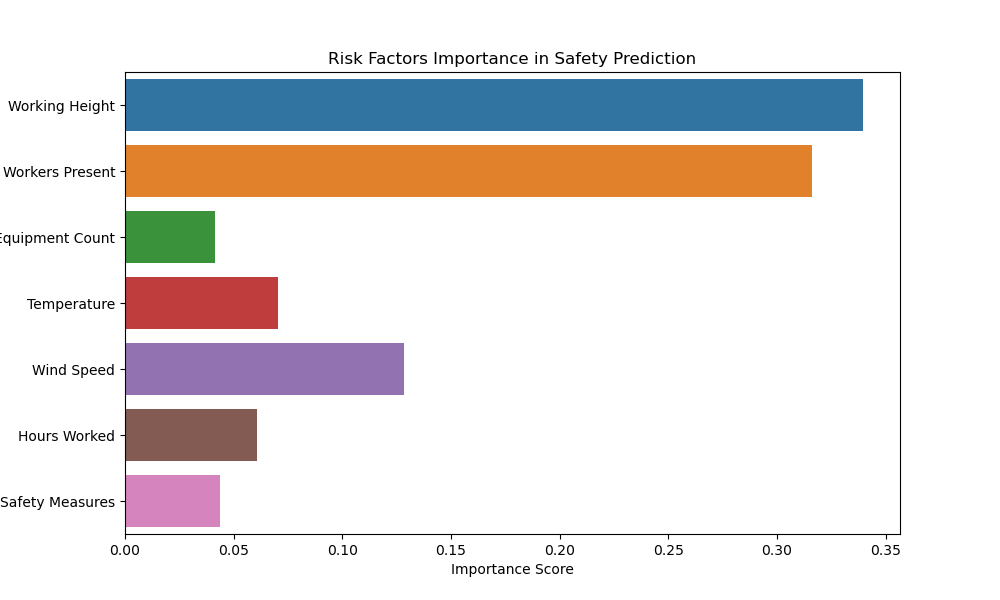
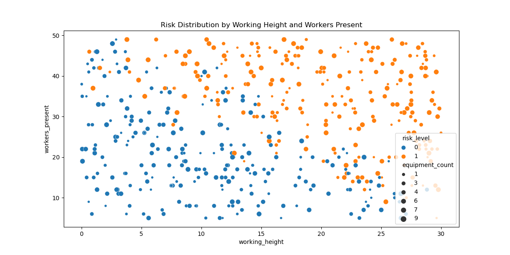

# Construction Safety AI Predictor

## 🎯 Overview
An AI-powered system for predicting and analyzing construction site safety risks. This project combines civil engineering expertise with machine learning to enhance construction site safety.

## 🚀 Key Features
- Safety incident prediction
- Risk factor analysis
- Real-time monitoring simulation
- Visual risk mapping
- Safety score calculation

## 💻 Technologies Used


## 📊 Results & Visualization

### Risk Factors Importance


Key Findings:
- Working Height appears to be a significant risk factor
- Number of workers present impacts safety levels
- Safety measures show effectiveness in risk reduction

### Risk Distribution Analysis


Analysis:
- Higher working heights correlate with increased risk
- Larger crews require additional safety considerations
- Equipment count influences risk levels

## 🛠️ Installation & Usage
```bash
# Clone repository
git clone https://github.com/Danial619/construction-safety-predictor.git

# Install dependencies
pip install -r requirements.txt

# Run the predictor
python src/safety_predictor.py
📈 Model Performance
Advanced risk prediction capabilities
Feature importance analysis
Visual risk assessment tools
🔄 Future Improvements
Real-time data integration
Mobile app development
IoT sensor integration
Advanced risk analytics
Historical data analysis
👤 Author
Danial619

📝 License
MIT License - see the LICENSE file for details